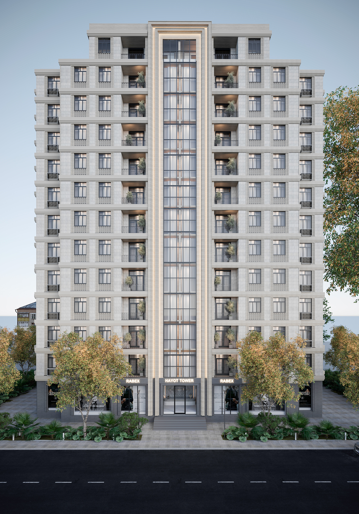

# Hayot Tower - Элитный Жилой Комплекс

Официальный сайт элитного жилого комплекса Hayot Tower. Проект представляет собой веб-приложение, разработанное на React, демонстрирующее элитную недвижимость с использованием современных веб-технологий.



## Содержание

- [Общая информация](#общая-информация)
- [Технологии](#технологии)
- [Структура проекта](#структура-проекта)
- [Реализованные функции](#реализованные-функции)
- [Запланированные функции](#запланированные-функции)
- [Установка и запуск](#установка-и-запуск)
- [Управление данными](#управление-данными)
- [Деплой](#деплой)
- [Лицензия](#лицензия)

## Общая информация

Проект представляет собой одностраничное приложение (SPA) для продвижения элитного жилого комплекса Hayot Tower. Сайт демонстрирует архитектуру, планировки, преимущества и удобства комплекса, позволяя потенциальным клиентам получить полное представление о проекте и оставить заявку на приобретение.

### Что реализовано:
- Основная структура React-приложения
- Интерактивный слайдер с основными видами комплекса
- Адаптивный дизайн для разных устройств
- Базовая навигация

### Что планируется:
- Раздел "О жилом комплексе" с ключевыми преимуществами
- Каталог доступных апартаментов с фильтрацией
- Галерея изображений по категориям
- Раздел удобств и инфраструктуры
- Форма обратной связи
- Планировки и варианты отделки
- Интерактивная карта местоположения
- Многоязычность (русский/английский)

## Технологии

Проект использует следующий стек технологий:

- **React**: Основной фреймворк для создания пользовательского интерфейса
- **React Slick**: Библиотека для создания карусели/слайдера
- **CSS3**: Стилизация всех компонентов
- **GitHub Actions**: CI/CD пайплайн для автоматического деплоя
- **GitHub Pages**: Хостинг сайта

## Структура проекта

## Реализованные функции

### 1. PropertySlider
Интерактивный слайдер, отображающий внешний вид жилого комплекса с разных ракурсов. Реализованы:
- Автоматическая прокрутка с настраиваемым интервалом
- Навигационные элементы (стрелки, индикаторы)
- Анимированные переходы между слайдами
- Информационные карточки с описанием для каждого слайда
- Адаптивность для различных экранов

### 2. PropertyCard
Компонент для отображения отдельных объектов недвижимости в каталоге. Включает:
- Изображение объекта
- Название и краткое описание
- Ключевые характеристики (площадь, количество комнат)
- Ценовую информацию
- Кнопку для получения дополнительной информации

## Запланированные функции

### 1. Система управления данными недвижимости
Централизованное хранение данных о недвижимости в структурированном формате для удобного управления и отображения. Будет реализовано через:
```javascript
// data/properties.js
export const properties = [
  {
    id: 1,
    title: 'Hayot Tower',
    titleRu: 'Хаёт Тауэр',
    slug: 'hayot-tower',
    category: 'apartment',
    categoryRu: 'Апартаменты',
    description: 'Exclusive living in the heart of the city',
    descriptionRu: 'Эксклюзивное проживание в самом сердце города',
    // ... другие поля
  },
  // ... другие объекты
]
```

### 2. Раздел "О жилом комплексе"
Информативный раздел, подчеркивающий ключевые преимущества комплекса:
- Архитектурная концепция
- Высококачественные материалы
- Интеллектуальные системы безопасности
- Инфраструктура и удобства
- Расположение и окружение

### 3. Детальные страницы объектов
Страницы с подробной информацией о каждом типе апартаментов:
- Галерея изображений
- Подробные планировки
- Технические характеристики
- Варианты отделки
- Цены и условия приобретения

### 4. Интерактивная карта
Отображение местоположения комплекса с возможностью просмотра ближайших объектов инфраструктуры:
- Транспортные узлы
- Образовательные учреждения
- Торговые центры
- Рекреационные зоны

### 5. Многоязычность
Реализация поддержки нескольких языков (русский и английский) с возможностью легкого переключения.

## Установка и запуск

Для локальной разработки:

```bash
# Клонирование репозитория
git clone https://github.com/ismoilovfk/build.git
cd build

# Установка зависимостей
npm install

# Запуск в режиме разработки
npm start

# Сборка для продакшена
npm run build

# Деплой на GitHub Pages
npm run deploy
```

## Управление данными

Чтобы добавить новый объект недвижимости:

1. Добавьте изображения в соответствующие папки в `public/images/`
2. Обновите данные в файле `data/properties.js` (будет создан)
3. Объекты с параметром `isFeatured: true` будут автоматически отображаться на главной странице

## Деплой

Проект настроен на автоматический деплой на GitHub Pages при пуше в ветку `master`. Настройки деплоя находятся в файле `.github/workflows/deploy.yml`.

## Лицензия

© 2023 Hayot Tower. Все права защищены.